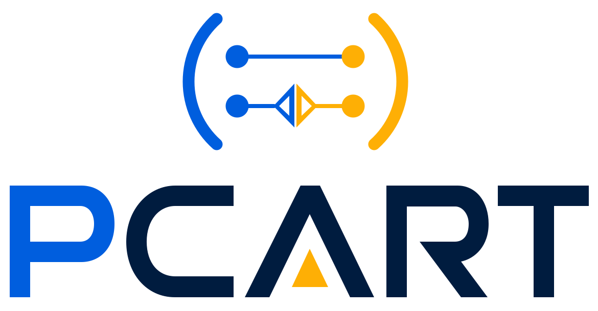

# PCART-tools

**An open-source program analysis toolchain for verifiable compatibility maintenance of Python and AI software under library evolution.**

Modern Python and AI software systems heavily depend on rapidly evolving third-party libraries. PCART-tools provides tools, benchmarks, and evaluation artifacts for analyzing, repairing, and validating compatibility issues caused by API changes, dependency upgrades, and library evolution.

Start with [PCART](https://github.com/PCART-tools/PCART) for API compatibility repair, [PCREQ](https://github.com/PCART-tools/PCREQ) for compatible requirements inference, and [PCBench](https://github.com/PCART-tools/PCBench) / [REQBench](https://github.com/PCART-tools/REQBench) for benchmarks.

## Toolchain at a Glance

| Area | Capability | Repository |
|---|---|---|
| API compatibility | Repair API parameter incompatibilities after library upgrades | [PCART](https://github.com/PCART-tools/PCART) |
| Dependency compatibility | Infer compatible requirements for Python third-party library upgrades | [PCREQ](https://github.com/PCART-tools/PCREQ) |
| API usage provenance analysis | Analyze how third-party APIs are imported, aliased, wrapped, and invoked across Python projects | [PCResolve](https://github.com/PCART-tools/PCResolve) |
| Native API extraction | Generate stubs for Python C extension APIs | [PCStubGen](https://github.com/PCART-tools/PCStubGen) |
| Compatibility risks | Detect variadic parameter compatibility pitfalls in Python APIs | [VPPDetector](https://github.com/PCART-tools/VPPDetector) |

## Benchmarks and Artifacts

- [PCBench](https://github.com/PCART-tools/PCBench): Benchmark for Python API parameter compatibility issues.
- [REQBench](https://github.com/PCART-tools/REQBench): Benchmark for compatible requirements inference in Python third-party library upgrades.
- [PCART-evaluation](https://github.com/PCART-tools/PCART-evaluation) and [PCREQ-evaluation](https://github.com/PCART-tools/PCREQ-evaluation): Evaluation artifacts for reproducing experimental results.
- [PCART-LLM](https://github.com/PCART-tools/PCART-LLM): Research artifact for LLM-based API compatibility analysis.
- [WebPCART](https://github.com/PCART-tools/WebPCART): Web platform for PCART-based compatibility analysis.

Licenses and citation information are provided in the corresponding repositories.

## Long-term Vision

PCART-tools aims to support practical and verifiable compatibility maintenance for real-world Python and AI software, including API and dependency evolution analysis, project-level compatibility reasoning, tool-verified repair and validation, and integration with development workflows such as CI and large-scale repository analysis.

## Maintainer

Maintained by the research group of [Dr. Guanping Xiao](https://guanpingxiao.github.io/) at Nanjing University of Aeronautics and Astronautics.
